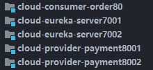

# yml 配置文件
1. 配置项后面的空格别漏了,需要有层次缩进

# MyBatis
1. mapper.xml在配置输入值的类型(parameterType) 时,直接输入对应的类名,因为在 mybatis 的配置文件中,配置了别名扫描包
2. Mybatis 配置文件 useGeneratedKeys 参数只针对 insert 语句生效，默认为 false。当设置为 true 时，表示如果插入的表以自增列为主键，则允许 JDBC 支持自动生成主键，并可将自动生成的主键返回。

# DAO

1. 使用 @mapper 注解(org.apache.ibatis.annotations.Mapper)

# Controller

1. 请求参数为自定义bean时,请求参数需要加上@Requesbody

# 服务分布

这些是整合Euerka

# 整合zookeeper
消费者的远程调用服务名称区分大小写,需要和调用的服务名称保持一致